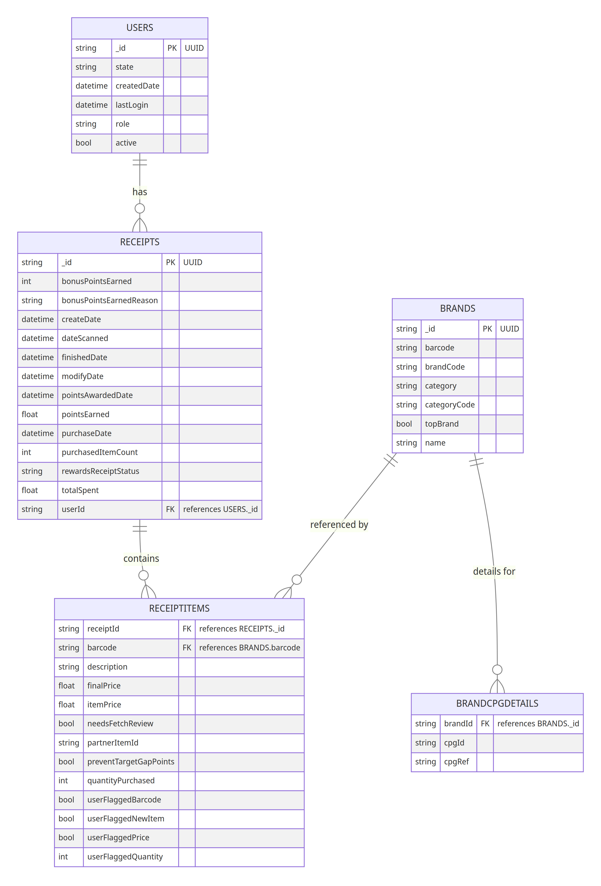

# Fetech-Product-Data-Analytics-Engineering

This project focuses on analyzing and structuring unstructured JSON data provided by Fetch Rewards, a hypothetical company. The main objectives are to design a structured relational data model, write SQL queries to answer specific business questions, identify and address data quality issues, and communicate findings effectively to stakeholders. Basically, there are four main requirements that this projects aims satisfy and they are as follow:

#### 1. Review of Unstructured Data and Relational Data Modeling
 
 #### Data Sources
 > [Receipts](https://habeebanalytics.s3.eu-north-1.amazonaws.com/receipts.json.gz)
  S3 URI s3://habeebanalytics/receipts.json.gz
 > [Brands](https://habeebanalytics.s3.eu-north-1.amazonaws.com/brands.json.gz)
  S3 URI: s3://habeebanalytics/brands.json.gz
 > [Users](https://habeebanalytics.s3.eu-north-1.amazonaws.com/users.json.gz)
  S3 URI: s3://habeebanalytics/users.json.gz

#### 2. SQL Query That Answers Four Predetermined Business Question
    The four predetermined business questions are:
    > i. When considering average spend from receipts with 'rewardsReceiptStatus’ of ‘Accepted’ or ‘Rejected’, which is greater?
    ii. When considering total number of items purchased from receipts with 'rewardsReceiptStatus’ of ‘Accepted’ or ‘Rejected’, which is greater? 
    iii. Which brand has the most spend among users who were created within the past 6 months?
    iv. Which brand has the most transactions among users who were created within the past 6 months?
   
#### 3. Data Quality Evaluation
#### 4. Stakeholder Communication
   
#### Analytical Tools Used

##### Cloud Data Warehouse: Snowflake
##### Cloud Object Storage: AWS S3 Bucket
##### Version Control: Git Bash
##### Repository: Github

### Assumptions

1. **Fetch_Rewards Data Warehouse:** Designed for small-scale operations with a product-centric analytics approach, housed in the `fetch` schema within the `Products` database.
2. **Data Ingestion from S3:** Utilizes stages for ingesting semi-structured JSON data from S3 buckets, indicating reliance on cloud storage fo r data collectio. **Data Format Choices:** 
   - JSON file format for semi-structured data likely from NoSQL databases or web applications.
   - GZIP compression for storage and transfer efficiency.
   - Format options like STRIP_OUTER_ARRAY suggest the need for JSON data cleanup during ingestion.
4. **Table Structure and Relationships:** 
   - Core tables: `receipts`, `users`, and `brands`, with relationships mapped in ER diagrams.
   - `receipts` table has a `VARIANT` column (`rewardsReceiptItemList`) for nested JSON, necessitating flattening into `receipt_items`.
   - `brands` table's `cpg` field contains nested JSON (`id` and `ref`), leading to parsing into `brand_cpg_details` for normalized analysis.
   - Link between `receipts` and `users` through `userId` in `receipts`, showing each receipt's user connection.
5. **Data Copy and Transformation:** 
   - Use of `COPY INTO` command for error-resilient data loading.
   - `TO_TIMESTAMP_NTZ` for normalizing JSON dates into a query-friendly timestamp format.
   - Transformation of nested JSON (`cpg`) into structured format within the `brands` table.
6. **Queries for Business Intelligence:** 
   - Focus on consumer behavior, brand performance, and temporal sales trends.
   - Interest in month-over-month data comparison to monitor market dynamics and consumer engagement.
7. **Data Quality and Exploration:** 
   - Some part of the quality data check were performed through observations
8. **Receipt Status Interpretation:** 
   - Receipt statuses `Finished` and `Submitted` are considered `ACCEPTED`.
   - Statuses `Flagged` and `Rejected` are considered `REJECTED`.
9.  The data is presummed not to change at any time.

## Review of Unstructured Data and Relational Data Modeling
Given the receipts, brands and users data, and the receipts_items and brand cgp detail from receipts and brands respectively, below show the relational data modelling designed in the Snowflake cloud data warehouse and equally obtainable in other cloud data warehouse:

#### Product.Fetch Relational Data Modeling/ Entity Relationship Diagram

## SQL Queries for Predetermined Business Question

given the relational above and the assumptions earlier stated, the four predetermined business are thus answered below:

#### 1. When considering average spend from receipts with 'rewardsReceiptStatus’ of ‘Accepted’ or ‘Rejected’, which is greater?

REWARD RECEIPT STATUS  | AVERAGE SPEND
-----------------------|-----------------------
              REJECTED | 85.10
              ACCEPTED | 80.85

> It is evident as seen from the table that the rejected is greater than the Accepted on average.

#### 2. When considering total number of items purchased from receipts with 'rewardsReceiptStatus’ of ‘Accepted’ or ‘Rejected’, which is greater?

REWARD RECEIPT STATUS  | TOTAL ITEMS PURCHASED
-----------------------|-----------------------
              ACCEPTED | 8184
              REJECTED | 1187
              
> From the table above, ACCEPTED is greater when considering the number of items purchased from receipts.

#### 3. Which brand has the most spend among users who were created within the past 6 months?

BRAND NAME            | TOTAL BRAND SPEND
----------------------|---------------------
Cracker Barrel Cheese | 253.26

> As seen from above, *Cracker Barrel Cheese* brand has the most spend among the users created within past 6 months.

#### 4. Which brand has the most transactions among users who were created within the past 6 months?

BRAND NAME            | TOTAL TRANSACTIONS
----------------------|---------------------
Tostitos              | 43

> The brand with most transactions within past 6 months is **Tostitos**

## Data Quality Evaluation

#### Untidiness (Structural Issues)

**receipts:**
> Contains both receipt-level and item-level information in a single table, suggesting a need for normalization.
General:
> No other immediate structural issues are apparent without more context on the data relationships. However, the potential overlap between brands and brand_cpg_details could be considered here once the relationship is clearer.

#### Messiness (Content Issues)

**users:**
>Incorrect data types for date columns (CREATEDDATE, LASTLOGIN).
brands:
>TOPBRAND column uses object data type possibly due to missing values, which may complicate analysis involving this boolean-like variable.
receipts:
> Mixed data types for columns that appear to be boolean (NEEDSFETCHREVIEW, ITEM_USERFLAGGEDNEWITEM), and numeric columns used for identifiers are in float64 due to NaNs, suggesting messy data entry or processing.
receipt_items:
> Mixed types for columns that seem to represent boolean values (NEEDSFETCHREVIEW, USERFLAGGEDNEWITEM).
> Inconsistent handling of missing data, with numerous missing values in user-flagged columns and BARCODE.

#### Completeness and Integrity

**users:**
> Missing values in STATE and LASTLOGIN.
> Duplicate rows identified.

**brands:**
> Significant missing values in BRANDCODE, CATEGORY, CATEGORYCODE, and TOPBRAND.
**receipts:**
> Substantial missing values across various columns, particularly item-related ones.
**receipt_items:**
> Extensive missing data, particularly in BARCODE and user-flagged columns, which may affect completeness and data quality.
**brand_cpg_details:**
>Appears complete with no missing values or duplicate rows, suggesting good integrity for this dataset. However, the relationship with brands needs to be checked for redundancy and consistency.

These categories highlight key areas for data cleaning and preparation. 

## Stakeholder Communication
